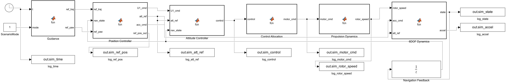
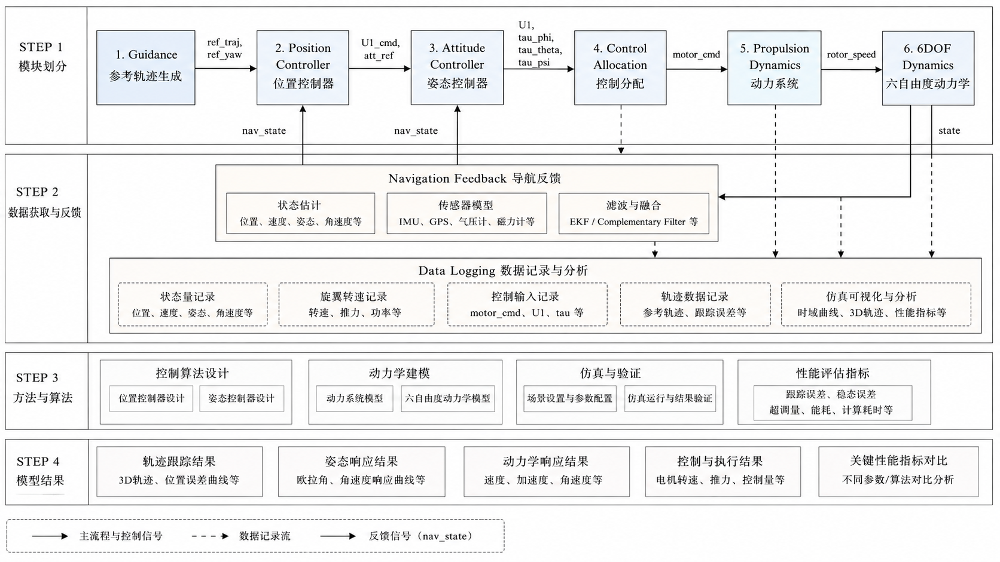
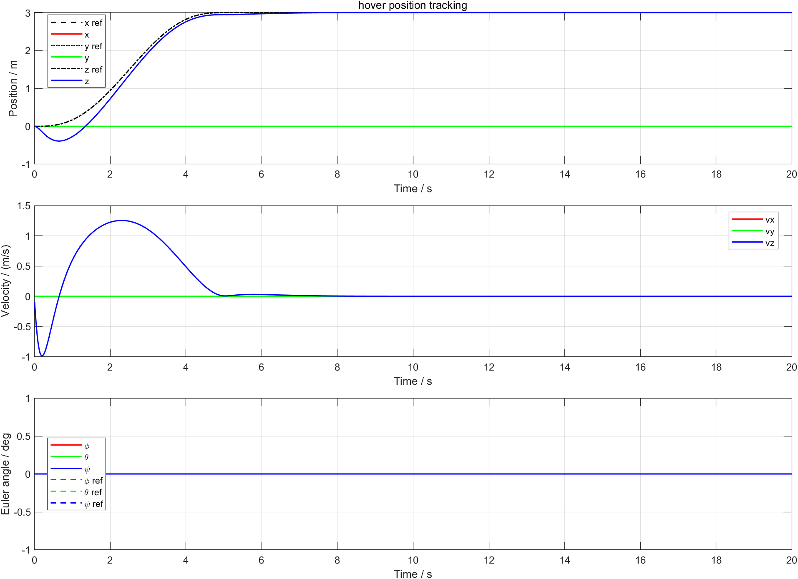
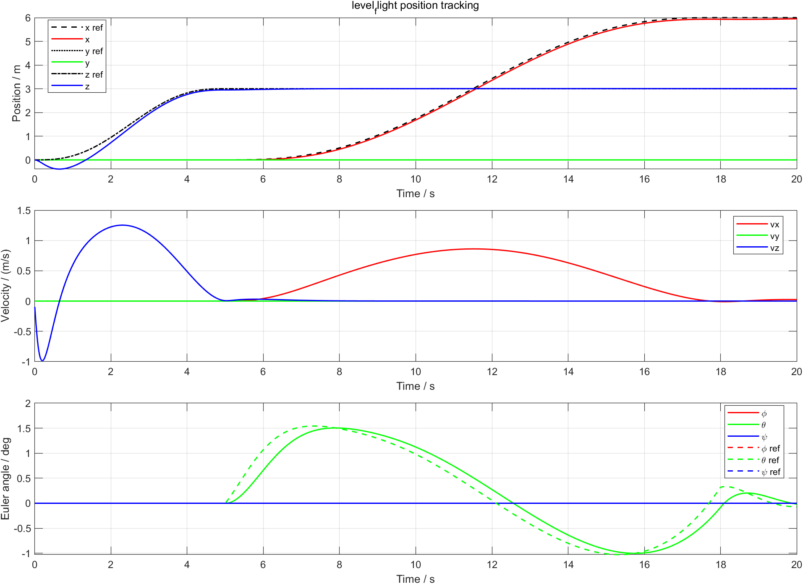
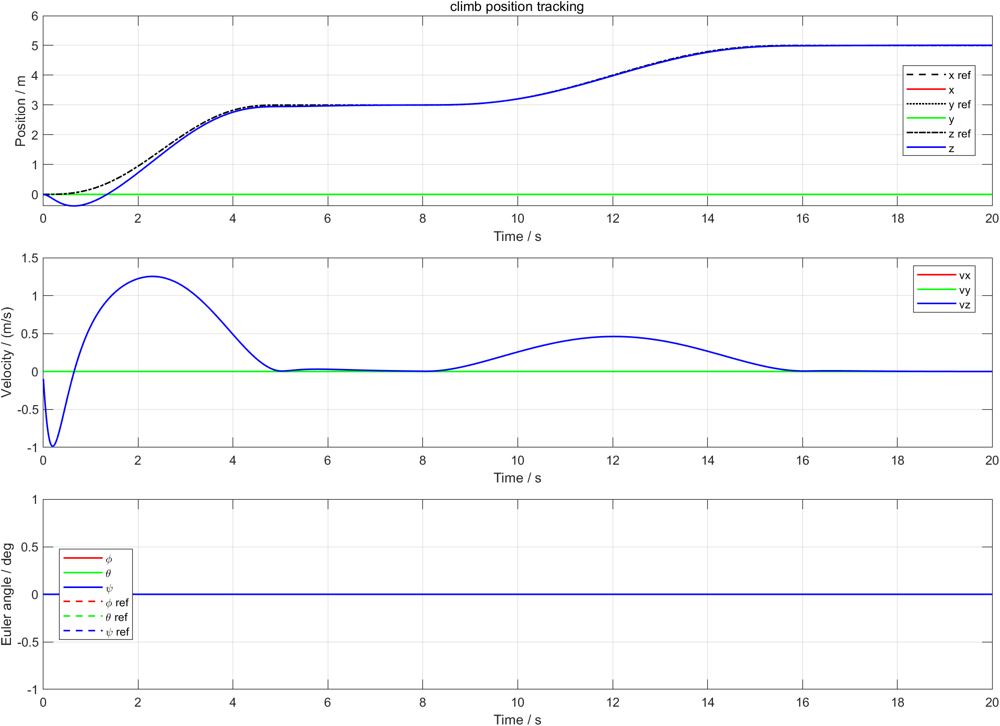
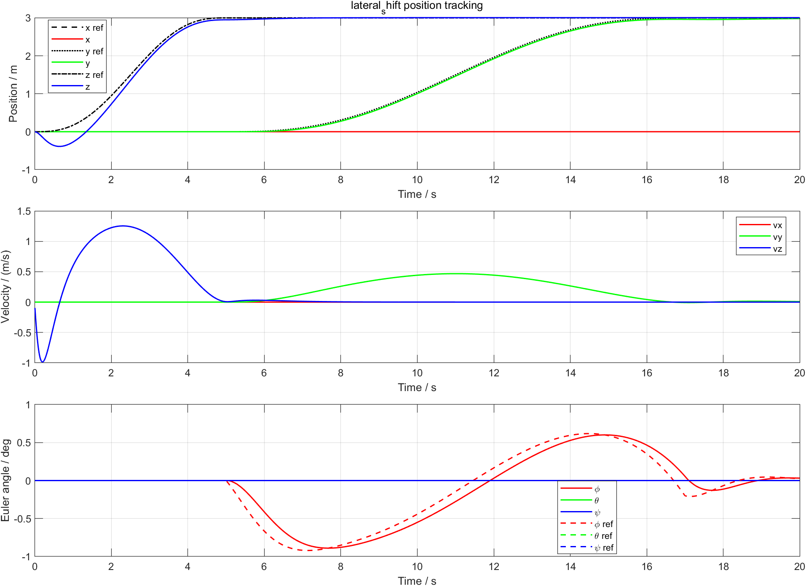

# CSUGX5
# 多旋翼无人机六自由度控制仿真系统

本项目是一个基于 **MATLAB/Simulink** 的多旋翼无人机六自由度控制仿真工程，围绕课程设计中的建模、控制、模块化软件结构和多工况验证要求展开。项目包含可运行的 Simulink 模型、MATLAB 仿真脚本、典型结果图和工程说明文档，可用于课程设计复现、无人机控制入门学习和后续模型扩展。

> 本工程面向课程级六自由度闭环控制仿真，重点展示控制系统结构、模块接口、典型工况响应和仿真复现流程，并非高保真气动仿真平台。

## 项目亮点

- 搭建了模块化 Simulink 六自由度闭环仿真模型。
- 建立了多旋翼无人机平动、转动、旋翼推力、控制分配和电机响应模型。
- 支持悬停、平飞、爬升、侧向机动四种典型飞行工况。
- 采用五次多项式参考轨迹，使位置指令更加平滑连续。
- 采用位置外环、姿态内环、控制分配和动力系统分层结构。
- 提供一键运行脚本，可自动完成模型生成、仿真运行、图像导出和指标统计。
- 整理了模型结构图、模块接口说明和典型仿真结果，便于报告撰写与复现检查。

## 系统结构

仿真系统按照无人机控制软件的典型数据流进行组织：

```text
Guidance
  -> Navigation Feedback
  -> Position Controller
  -> Attitude Controller
  -> Control Allocation
  -> Propulsion Dynamics
  -> 6DOF Dynamics
  -> Data Logging
```

顶层 Simulink 模型如下图所示：



软件框架结构示意如下：



## 仿真工况

| 模式 | 工况名称 | 验证目标 |
|---:|---|---|
| 1 | 悬停 | 上升至约 `(0, 0, 3) m` 并保持稳定 |
| 2 | 平飞 | 在保持高度约 `3 m` 的同时沿 `x` 方向飞行至约 `6 m` |
| 3 | 爬升 | 从悬停高度继续上升至约 `5 m` |
| 4 | 侧向机动 | 在保持高度约 `3 m` 的同时沿 `y` 方向移动至约 `3 m` |

## 典型结果

当前模型在 MATLAB R2024a 环境下的典型运行结果如下。由于求解器设置和控制参数可能调整，具体数值可能存在轻微差异。

| 工况 | 最终位置 / m | 主要稳态误差 |
|---|---:|---:|
| 悬停 | `[0.0000, 0.0000, 3.0054]` | 高度 RMS 误差约 `0.0055 m` |
| 平飞 | `[5.9501, 0.0000, 3.0054]` | `x` 向 RMS 误差约 `0.0684 m` |
| 爬升 | `[0.0000, 0.0000, 5.0061]` | 高度 RMS 误差约 `0.0077 m` |
| 侧向机动 | `[0.0000, 2.9827, 3.0054]` | `y` 向 RMS 误差约 `0.0345 m` |

悬停、平飞、爬升和侧向机动的状态响应示例如下：









## 运行环境

- MATLAB R2024a 或更新版本
- Simulink
- 支持 MATLAB Function Block 的基础 Simulink 环境

项目在 MATLAB R2024a 下完成开发和验证。

## 快速开始

在 MATLAB 中进入项目根目录，然后运行：

```matlab
addpath('scripts')
summary = run_all();
```

运行后程序会自动完成以下步骤：

1. 生成或更新 `model/uav_6dof_course.slx`。
2. 依次运行悬停、平飞、爬升和侧向机动四种工况。
3. 将仿真曲线、数据文件和统计指标保存至 `results/` 文件夹。
4. 在命令行输出各工况的最终位置和结果目录。

也可以运行单个工况：

```matlab
addpath('scripts')
run_hover
run_level_flight
run_climb
run_lateral_shift
```

如果只想从示例入口启动，可运行：

```matlab
run('examples/run_project.m')
```

## 仓库结构

```text
.
|-- model/
|   `-- uav_6dof_course.slx
|-- scripts/
|   |-- create_course_model.m
|   |-- init_uav_params.m
|   |-- run_all.m
|   |-- run_hover.m
|   |-- run_level_flight.m
|   |-- run_climb.m
|   |-- run_lateral_shift.m
|   |-- plot_sim_results.m
|   |-- generate_chapter4_figures.m
|   `-- export_interface_summary.m
|-- docs/
|   |-- architecture.md
|   |-- module_interface_summary.md
|   |-- results_summary.md
|   |-- release_checklist.md
|   `-- figures/
|-- examples/
|   `-- run_project.m
|-- .gitignore
|-- LICENSE
`-- README.md
```

## 主要文件说明

| 文件 | 作用 |
|---|---|
| `model/uav_6dof_course.slx` | 六自由度控制仿真 Simulink 主模型 |
| `scripts/create_course_model.m` | 通过脚本生成或重建 Simulink 模型 |
| `scripts/init_uav_params.m` | 初始化质量、惯量、旋翼、电机、阻尼和控制参数 |
| `scripts/run_all.m` | 一键运行四种工况并汇总结果 |
| `scripts/plot_sim_results.m` | 绘制状态响应、控制量、旋翼转速和三维轨迹图 |
| `scripts/generate_chapter4_figures.m` | 生成模块验证和报告用辅助图 |
| `docs/architecture.md` | 软件框架与模型结构说明 |
| `docs/module_interface_summary.md` | 主要模块接口说明 |
| `docs/results_summary.md` | 仿真结果摘要 |

## 模型边界

为了突出课程设计中的六自由度建模与闭环控制验证，本项目做了适度简化：

- 动力学模型采用刚体六自由度模型，并加入重力和线性阻尼。
- 旋翼推力与转速平方成正比，电机响应采用一阶惯性环节。
- 当前版本未默认加入风扰、传感器噪声、执行机构故障和复杂气动干扰。
- 欧拉角姿态描述适用于本项目的小角度飞行验证范围。

这些简化使模型更适合作为课程设计、控制结构验证和仿真软件框架展示使用。

## 后续改进方向

- 增加风扰和传感器噪声模型，验证控制系统抗扰能力。
- 引入扩展卡尔曼滤波或互补滤波，完善导航估计环节。
- 增加电机饱和、故障和控制重构仿真。
- 将姿态描述由欧拉角扩展为四元数，提升大姿态机动适用性。
- 与三维可视化环境或飞行器设计工具联合仿真。

## 许可证

本项目采用 MIT License 开源，详见 [LICENSE](LICENSE)。
